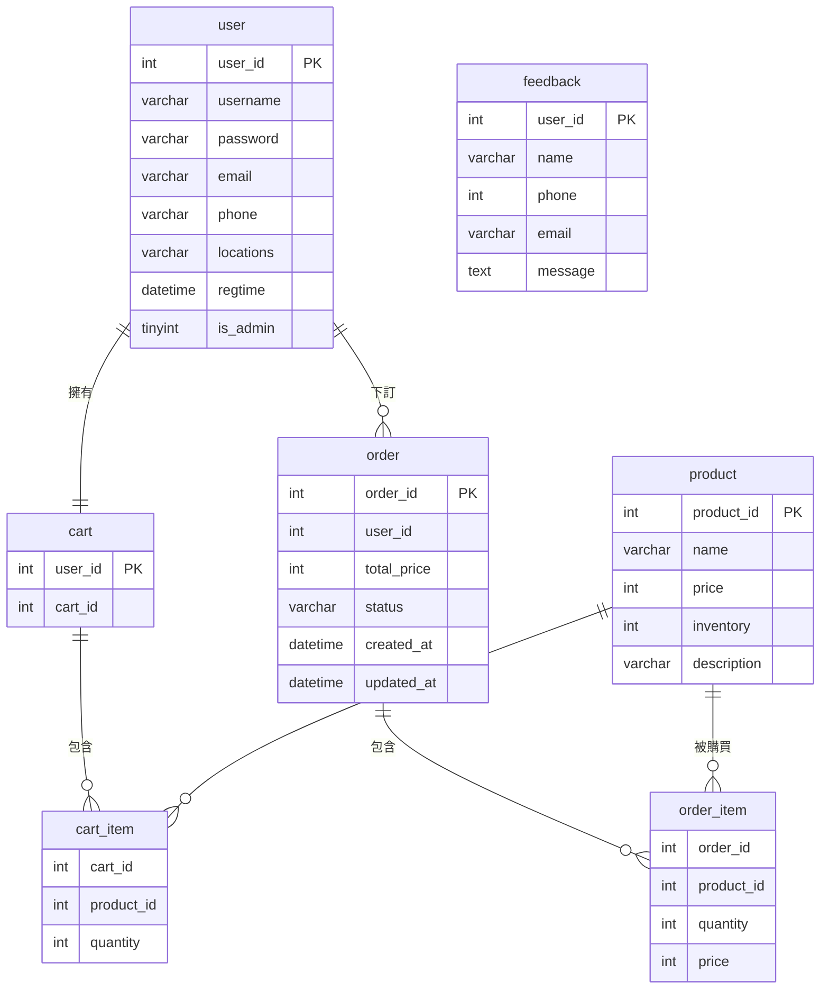

# 香氛小築（MTS）電商購物系統

> 資料庫管理系統課程期末專案｜以 PHP 與 MySQL（MariaDB）實作香氛蠟燭電商網站，資料庫依正規化原則設計為 7 張資料表，並以交易（Transaction）確保結帳流程的一致性。

---

## 摘要（Abstract）

電商系統的核心是資料。商品、會員、購物車與訂單之間的關係若設計不良，查詢與維護都會出問題。

本專案以「香氛小築」為情境，建置一個販售香氛蠟燭與茶罐的購物網站。系統分成一般會員與管理員兩種角色。會員可瀏覽商品、加入購物車、結帳並查詢訂單。管理員可管理商品、訂單狀態與會員。

設計重點有兩項。第一，資料庫拆成 7 張正規化資料表，以關聯表處理多對多關係。第二，結帳時把「檢查庫存、建立訂單、扣庫存、清空購物車」包進同一個交易，任何一步失敗就整體回復。

## 研究動機（Motivation）

課堂上學的是正規化、關聯與 SQL。單看講義，很難感受到資料表拆得好不好的差別。

購物系統剛好把這些概念全部用上：會員與訂單是一對多，訂單與商品是多對多，購物車與訂單之間還有資料搬移。本專案藉由實作一個完整流程，驗證課堂所學。

## 系統架構（System Architecture）

```
使用者瀏覽器
     │  HTTP
     ▼
PHP 應用程式（Session 管理登入狀態）
     │  mysqli 預備敘述（Prepared Statement）
     ▼
MySQL / MariaDB 資料庫 shop（7 張資料表）
```

| 層級 | 技術 |
| --- | --- |
| 前端 | HTML、Bootstrap 5.3.0（CDN） |
| 後端 | PHP 8.2、mysqli |
| 資料庫 | MariaDB 10.4（以 phpMyAdmin 5.2.1 管理） |
| 執行環境 | 本機伺服器（localhost） |

## 資料庫設計（Database Design）

資料庫名稱為 `shop`，共 7 張資料表。

### ER 圖



### 資料表說明

| 資料表 | 用途 | 主要欄位 | 關聯 |
| --- | --- | --- | --- |
| `user` | 會員與管理員帳號 | `user_id`、`username`、`password`、`email`、`phone`、`locations`、`regtime`、`is_admin` | 與 `cart`、`order` 為一對一、一對多 |
| `product` | 商品主檔 | `product_id`、`name`、`price`、`inventory`、`description` | 被 `cart_item`、`order_item` 參照 |
| `cart` | 每位會員一個購物車 | `user_id`、`cart_id` | 對應一位會員 |
| `cart_item` | 購物車明細 | `cart_id`、`product_id`、`quantity` | 連接 `cart` 與 `product` |
| `order` | 訂單主檔 | `order_id`、`user_id`、`total_price`、`status`、`created_at`、`updated_at` | 屬於一位會員 |
| `order_item` | 訂單明細 | `order_id`、`product_id`、`quantity`、`price` | 連接 `order` 與 `product` |
| `feedback` | 聯絡我們的留言 | `name`、`phone`、`email`、`message` | 獨立資料表 |

### 設計說明

- **多對多關係拆成關聯表。** 購物車與商品是多對多，訂單與商品也是多對多。`cart_item` 與 `order_item` 各自處理其中一個。
- **訂單明細保存下單當時的單價。** `order_item.price` 是快照。之後商品調價，歷史訂單的金額不會變。
- **訂單狀態有五種。** `pending`（處理中）、`paid`（已付款）、`shipped`（已出貨）、`completed`（已完成）、`cancelled`（已取消）。預設值為 `pending`。
- **註冊時同步建立購物車。** 使用者建立成功後，系統立刻在 `cart` 新增一筆對應資料。

## 主要功能（Features）

### 會員端

| 功能 | 說明 |
| --- | --- |
| 註冊 | 檢查使用者名稱（3–20 字元且不重複）、電子郵件不重複、電話（10–15 碼，僅數字與連字號）、地址（5–100 字元）、密碼（6–20 字元）與確認密碼一致 |
| 登入與登出 | 以 Session 記錄使用者編號、名稱與管理員身分 |
| 商品瀏覽 | 商品列表與商品詳細頁 |
| 購物車 | 加入商品、更新數量、檢視內容與總金額 |
| 結帳 | 檢查庫存後建立訂單，流程見下節 |
| 訂單查詢 | 查看個人訂單（依金額由高到低排列）與訂單明細 |
| 個人資料與設定 | 修改姓名、電子郵件、電話、地址與密碼，修改前須驗證目前密碼 |
| 資訊頁面 | 關於我們、聯絡我們、常見問題 |

首頁另有「隨機推薦」區塊，每次載入隨機顯示 4 項商品。

### 管理員端

管理頁面皆先檢查登入者是否具管理員身分，非管理員無法進入。

| 功能 | 說明 |
| --- | --- |
| 商品管理 | 新增、編輯、刪除商品 |
| 訂單管理 | 檢視所有一般會員的訂單，依狀態篩選，並更新訂單狀態 |
| 會員管理 | 檢視會員列表、刪除會員、切換管理員權限 |

### 結帳流程與交易控制

結帳在單一資料庫交易中完成，共六步：

1. 檢查購物車內每項商品的庫存是否足夠。
2. 計算購物車總金額。
3. 在 `order` 新增一筆訂單，狀態為 `pending`。
4. 把 `cart_item` 複製到 `order_item`，同時寫入當下單價。
5. 依購買數量扣除 `product.inventory`。
6. 清空該會員的 `cart_item`。

任何一步出錯，交易會回復，訂單不會成立，庫存也不會被扣除。

加入購物車時，系統以 `SELECT ... FOR UPDATE` 鎖定該商品的庫存紀錄，避免同時操作造成庫存判斷錯誤。

## 商品資料（Sample Data）

資料庫附有 13 項範例商品：12 款香氛蠟燭與 1 款旅行小茶罐。蠟燭定價 980 元，茶罐 280 元。每項商品都有名稱、價格、庫存、香調描述，以及 `images/` 中對應的商品圖片。

資料庫另含範例會員、管理員帳號與 3 筆範例訂單，方便直接測試。

## 專案結構（Repository Structure）

```
fragrance_shopping_website/
├── 購物網站/
│   ├── index.php              # 首頁（隨機推薦商品）
│   ├── about_us.php           # 關於我們
│   ├── contact.php            # 聯絡我們（寫入 feedback）
│   ├── faq.php                # 常見問題
│   ├── config/
│   │   └── database.php       # 資料庫連線設定
│   ├── includes/
│   │   ├── header.php         # 共用導覽列
│   │   ├── footer.php         # 共用頁尾
│   │   ├── auth.php           # 註冊與登入
│   │   └── functions.php      # 商品、購物車、訂單、會員的共用函式
│   ├── products/
│   │   ├── list_products.php  # 商品列表
│   │   └── detail.php         # 商品詳細頁
│   ├── cart/
│   │   ├── add_to_cart.php    # 加入購物車
│   │   ├── update_cart.php    # 更新數量
│   │   ├── view_cart.php      # 檢視購物車
│   │   └── checkout.php       # 結帳
│   ├── user/
│   │   ├── register.php       # 註冊
│   │   ├── login.php          # 登入
│   │   ├── logout.php         # 登出
│   │   ├── profile.php        # 個人資料
│   │   ├── settings.php       # 帳號設定
│   │   ├── orders.php         # 我的訂單
│   │   └── order_details.php  # 訂單明細
│   ├── admin/
│   │   ├── products.php       # 商品管理
│   │   ├── add_product.php    # 新增商品
│   │   ├── edit_product.php   # 編輯商品
│   │   ├── delete_product.php # 刪除商品
│   │   ├── orders.php         # 訂單管理
│   │   └── users.php          # 會員管理
│   ├── images/                # 商品圖片
│   └── 資料庫/
│       └── shop.sql           # 資料庫匯出檔
└── README.md
```

## 安裝與執行（Installation）

以下以 XAMPP 為例。

1. 安裝 XAMPP，啟動 **Apache** 與 **MySQL**。
2. 將 `購物網站` 資料夾複製到 `htdocs`，並改名為 `final_project`。程式內的連結路徑固定為 `/final_project/`。
3. 開啟 `http://localhost/phpmyadmin/`，建立名為 `shop` 的資料庫，編碼選 `utf8mb4_general_ci`。
4. 選取 `shop` 資料庫，匯入 `資料庫/shop.sql`。
5. 確認 `config/database.php` 的連線設定與本機一致。預設為使用者 `root`、密碼空白。
6. 開啟 `http://localhost/final_project/index.php`。

## 限制與未來工作（Limitations and Future Work）

**限制**

- 密碼以明碼儲存，登入時直接比對。正式環境應改用雜湊，例如 PHP 的 `password_hash()`。
- 資料庫只宣告主鍵，未建立外鍵約束。資料表之間的關聯由程式邏輯維持。
- `cart_item` 與 `order_item` 沒有複合主鍵，同一商品理論上可重複寫入。
- 訂單狀態由管理員手動更新，尚未串接金流。
- 「聯絡我們」頁面自行建立 PDO 連線，未共用 `config/database.php` 的設定，資料庫參數因此分散在兩處。
- `feedback` 資料表用 `user_id` 當自動遞增主鍵，但實際記錄的是留言者資料，欄位命名容易造成誤解。

**未來工作**

- 密碼改用雜湊儲存。
- 補上外鍵約束與複合主鍵，讓資料庫本身保證參照完整性。
- 串接第三方金流，付款成功後自動更新訂單狀態。
- 加入商品搜尋、分類與排序，並讓會員端訂單也能依狀態篩選。
- 將 `feedback` 的主鍵欄位改名，並在後台加入留言檢視頁面。

## 作者（Author）

傅珮茵（Fu Pei-Yin）
國立中興大學 資訊管理學系
